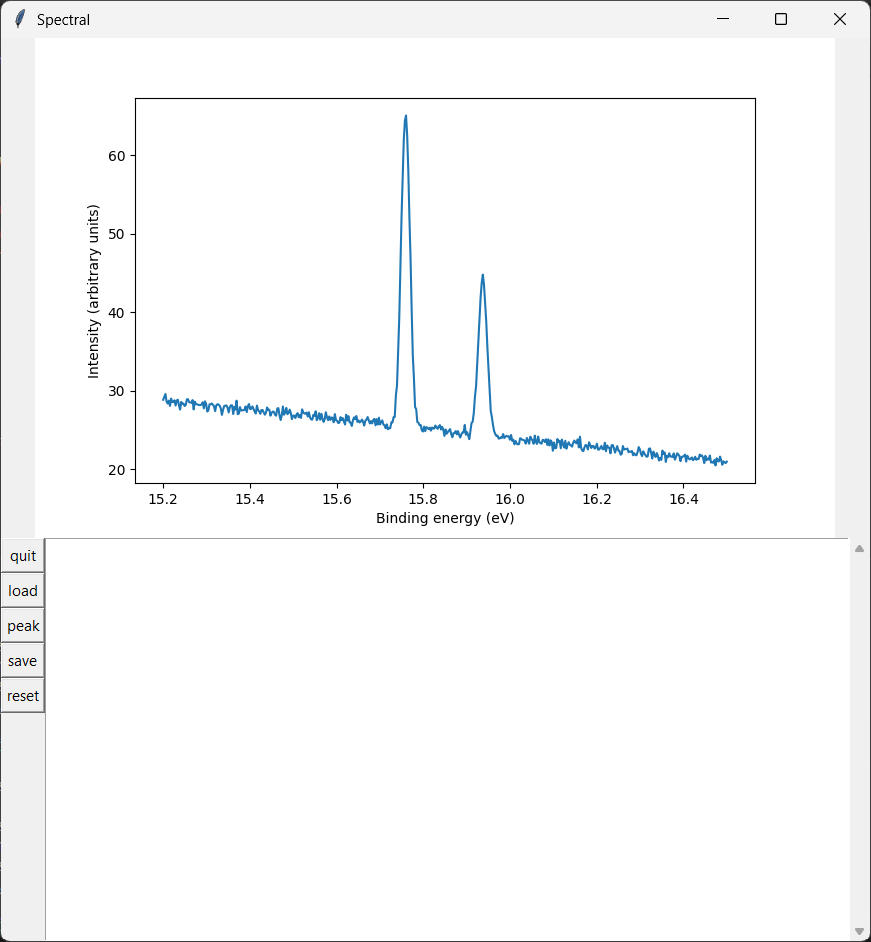
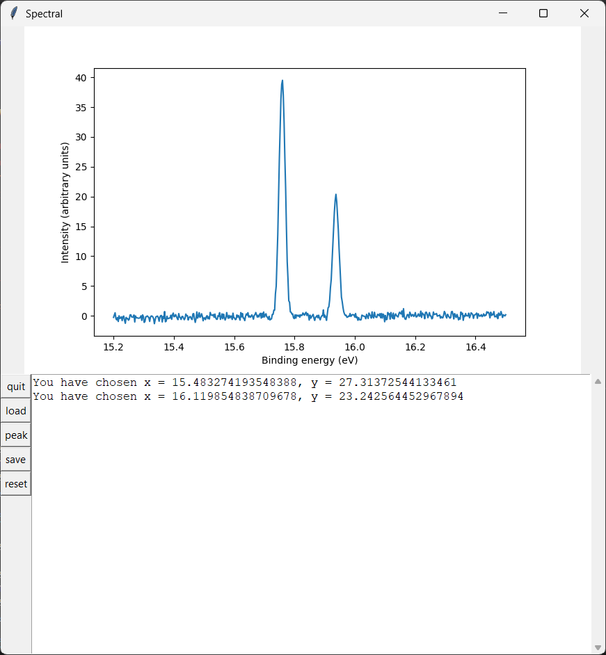

This is my assignment in the programming course. The assignment's requirement is in the Instruction file.

In general, the requirement is analyzing the spectral raw data provided in the "spektri" folder to extract the useful information and show the information in the chart.

Before analyzing, the data is like this: 

After analyzing, the most useful information are highlighted, while the less useful one stepped back.

